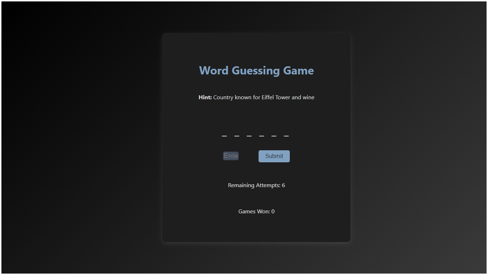

# Word Guessing Game 🎮

A simple yet engaging word guessing game built with HTML, CSS, and JavaScript. Perfect for testing your vocabulary skills and having fun!

## Live Demo

Play now: [https://mdmohsinhaider.github.io/Word-Guessing-Game/](https://mdmohsinhaider.github.io/Word-Guessing-Game/)

---

## How to Play

- The game randomly selects a word and displays a **hint** to help you guess it.
- Enter one letter at a time and submit your guess.
- If your guess is correct, the letter appears in its correct position(s).
- If your guess is incorrect, you lose an attempt.
- The game ends when:
  - All letters in the word are guessed (You Win!)
  - You run out of attempts (Game Over)

---

## Features

- Random word and hint on each new game
- Responsive layout for mobile and desktop
- Tracks used/wrong letters, so no repeated guesses
- User-friendly interface
- Instant feedback for correct and wrong guesses

---

## Technologies Used

- **HTML5** – Markup structure  
- **CSS3** – Modern styling  
- **JavaScript** (ES6) – Game logic

---

## About the Developer

Made with 💻 by Md Mohsin Haider  
- GitHub: [mdmohsinhaider](https://github.com/mdmohsinhaider)  
- Role: Software Developer, India

---

## Future Improvements

- [ ] Add different categories (e.g., animals, places, objects)
- [ ] Implement difficulty levels
- [ ] Add sound and effects for win/loss
- [ ] Scoreboard and high score tracking

---

## License

This project is licensed under the MIT License.  
Feel free to use, modify, and share!

---

## Contributing

Contributions, issues, and feature requests are welcome!  
Give a ⭐️ if you like this game!

